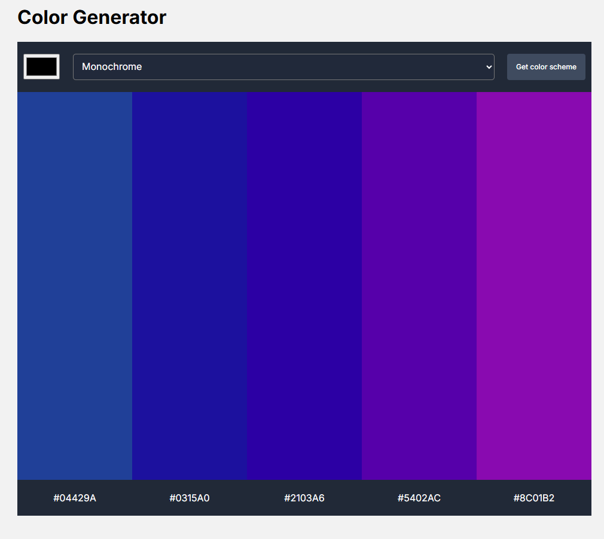

🎨 Color Generator App

A simple and intuitive web app that helps users generate color palettes from a selected base color. Users can choose a color, select a color scheme mode, and instantly view a curated palette. Built with HTML, CSS, and JavaScript and powered by The Color API.

🌈 Features

✅ Pick a color using a color input
✅ Choose from multiple color harmony modes (monochrome, triad, etc.)
✅ Automatically generate a color palette
✅ Displays HEX values for each color
✅ Click to copy HEX value to clipboard
✅ Lightweight + easy to customize

🛠 Tech Stack

HTML

CSS

JavaScript

The Color API (https://www.thecolorapi.com/)

🔧 How It Works

User chooses a base color

User selects a color mode from the dropdown

App fetches palette data from The Color API

Color swatches are displayed along with HEX values

Clicking a color or HEX code copies it to clipboard

🚀 Getting Started
Clone project
git clone https://github.com/kpwebdevelopment/color-generator

Open locally

Open index.html in your browser.

No build steps — no dependencies — just run and go!

📦 Project Structure
/
├── index.html
├── style.css
└── app.js

📸 Demo

Example:

✨ Future Enhancements

Save palettes to local storage

Export palettes as JSON/PNG

Copy all colors at once

Random color generator

Accessibility tweaks

📜 License

MIT — free to use, modify, share.
